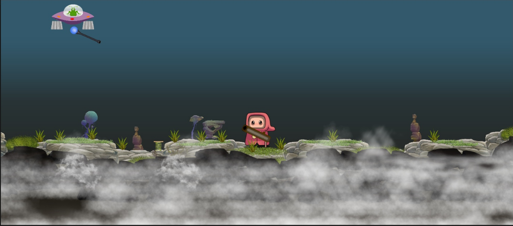
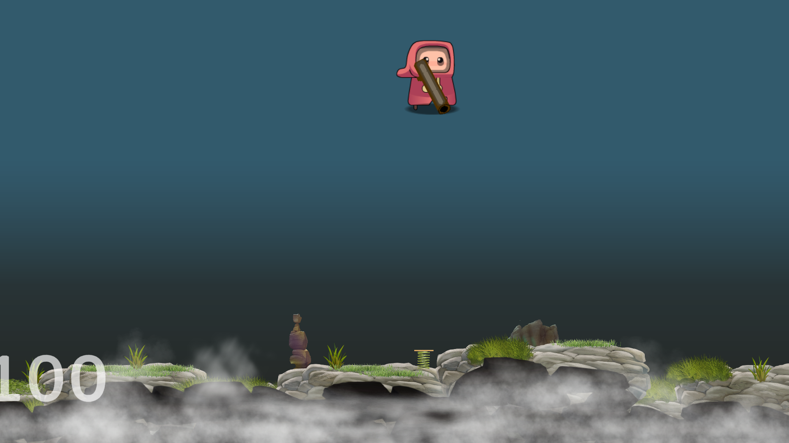
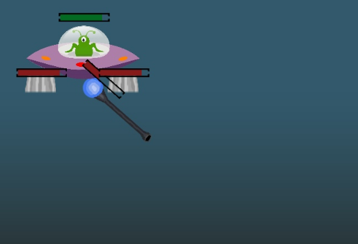

= Практические работы по курсу "Разработка игр"

В качестве выполненных практических работ, мною была создана игра, включающая в себя все игровые механики,
предложенные в практических работах. По итогу получился 2D шутер в стиле фентази.

.Основной сскриншот игры

Суть игры - различными способами сбить UFO (Подстрелить, подорвать, сбить с курса, оттолкнув)

== Практическая работа 3

1. *Написать свой скрипт контроллера (передвижение).*
+
--
Для передвижения был написан скрипт

[source, .net]
----
var movement = new Vector2(Input.GetAxis("Horizontal"), 0f);
        if (movement.x > 0 && isFacingLeft)
        {
            isFacingLeft = !isFacingLeft;
            transform.localRotation = Quaternion.Euler(0, 180, 0);
        } else if (movement.x < 0 && !isFacingLeft)
        {
            isFacingLeft = !isFacingLeft;
            transform.localRotation = Quaternion.Euler(0, 0, 0);
        }
----

Данный скрипт отвечает за движение игрока влево, вправо а также за поворот  его лица в сторону движения.
--
2. *Реализовать стрельбу.*
+
--
Реализовал стрельбу по принципу прицеливания мышью.

Сначала, получаю __координаты курсора мыши__, относительно игры

[source, .net]
----
public class MouseUtils
{
    public static Vector3 GetMouseWorldPosition()
    {
        return GetAbsolutePointPosition(Input.mousePosition);
    }

    public static Vector3 GetAbsolutePointPosition(Vector3 point)
    {
        Vector3 vec = Camera.main.ScreenToWorldPoint(point);
        vec.z = 0f;
        return vec;
    }

}
----

Скрипт, отвечающий за точку, из которой выходит снаряд, угол снаряда, относительно горизонта
и вектор импульса, который передается снаряду

[source, .net]
----
 void Update()
    {
        HandleAiming();
        if (Input.GetButtonDown("Fire1"))
        {
            Shoot();
        }
    }

    private long lastFireMillis = 0;
    private void Shoot()
    {
        var now = DateTimeOffset.Now.ToUnixTimeMilliseconds();
        if (lastFireMillis + shootDelayMillis > now)
            return;
        gameObject.GetComponent<AudioSource>().PlayOneShot(fireSound);
        var bulletPoint = weapon.GetChild(0);
        var bullet = Instantiate(bulletPrefab, bulletPoint.position, bulletPoint.rotation);
        var weaponAngel = bullet.transform.eulerAngles.z;

        var x = buletForce * Mathf.Cos(weaponAngel * Mathf.Deg2Rad);
        var y = buletForce * Mathf.Sin(weaponAngel * Mathf.Deg2Rad);
        var shootEffect = Instantiate(shootEffectPrefab, bulletPoint.position, bulletPoint.rotation);
        bullet.GetComponent<Rigidbody2D>().AddForce(new Vector2(x, y), ForceMode2D.Impulse);
        lastFireMillis = now;
        Destroy(shootEffect, 0.2f);
    }

    private void HandleAiming()
    {
        var mousePosition = MouseUtils.GetMouseWorldPosition();
        var aimDirtection = (mousePosition - transform.position).normalized;
        var angel = Mathf.Atan2(aimDirtection.y, aimDirtection.x) * Mathf.Rad2Deg;
        weapon.eulerAngles = new Vector3(0, 0, angel);
        weaponAngel = weapon.GetChild(0).transform.eulerAngles.z;
    }
----
--
3. *Реализовать спаунер ротивников.*
4. *Пусть ваш снаряд​ ​отнимает​ ​жизни ​​и​ ​убивает ​​противников.*
+
--
В качестве противника реализовал летающую тарелку. Суть в том, что каждый компонент в ней отвечает за свою
конкретную функцию и может быть отдельно уничтожен игроком.

* Двигатель - Основная задача - просто давать импульс в сторону, кулда смотрит сопло с силой, которая задана из вне.
* Кабина - Основной контролирующий элемент кораблем. - Он отвечает за управление двигателями и перелет влево/вправо
* Турель (Задача из следю лабораторных)

Чтобы у какого-либо элемента (Будь то вражеский корабль и его част или сам игрок) отнимались жизни при столкновении с пулей,
каждый элемент, который можно уничтожить наследуется от абстрактного класса _DamageableComponent_

[source, .net]
----
public abstract class DamageableComponent : MonoBehaviour
{
    public int health;
    int remainHealth;

    private void Start()
    {
        remainHealth = health;
        if (healthBarObj != null)
        {
            var healthBar = healthBarObj.GetComponent<HealthPreview>();
            healthBar.setHealth(remainHealth, health);
        }
    }

    public void Damage(int damage, float delay = 0f)
    {
        remainHealth-=damage;
        if (healthBarObj != null)
        {
            var healthBar = healthBarObj.GetComponent<HealthPreview>();
            healthBar.setHealth(remainHealth, health);
        }
        if (remainHealth <= 0)
        {
            remainHealth = 0;
            DestroyElement(delay);
        }
    }

    public abstract void DestroyElement(float delay = 0f);

}
----

Каждому элементу задается параметр health - отвечат за кол-во здоровья элемента а также
каждый компонент реализует метод _DestroyElement(float delay = 0f)_, внутри которого прописывается логика при уничтожении
_delay_ - задержка с которой элемент должен быть уничтожен (использовал, чтобы более красочно отработать уничтожения элементов - далее расскажу почему)

Класс, отвечающий за компонент _Двигатель_

[source, .net]
----
public class EnimyComponentEngine : DamageableComponent
{

    public GameObject engineAnimObject;
    public GameObject firePrefab;

    private bool isWorking = true;

    public override void DestroyElement(float delay)
    {
        isWorking = false;
        Destroy(gameObject, delay);
    }

    public void MakeImpulse(float power) {
        if (!isWorking)
            return;
        var engineEffect = Instantiate(firePrefab, engineAnimObject.transform.position, engineAnimObject.transform.rotation);
        var spaceShip = transform.parent.GetComponent<Rigidbody2D>();
        var angel = (90 + transform.eulerAngles.z) * Mathf.Deg2Rad;
        var x = power * Mathf.Cos(angel);
        var y = power * Mathf.Sin(angel);
        spaceShip.AddForce(new Vector2(x, y), ForceMode2D.Impulse);
        Destroy(engineEffect, 0.1F);
    }

}
----

Класс, отвечающий за компонет _Кабина_

[source, .net]
----
using System.Collections;
using System.Collections.Generic;
using UnityEngine;

public class EnimyComponentCabine : MonoBehaviour, DistanceCheckListener, CollisionListener
{

    public float speed;
    public float chaseDistance;

    private Transform target;
    private Vector2 homePosition;
    private bool isWorking = true;
    private bool isMinDistanceReached = false;

    public void DestroyElement()
    {
        isWorking = false;
        Destroy(gameObject);
    }

    public void onMinDistance()
    {
        if(isWorking)
            isMinDistanceReached = true;
    }

    public void onMaxDistance()
    {
        if (isWorking)
            isMinDistanceReached = false;
    }

    public void onInsaneDistance()
    {
        DestroyElement();
    }

    public void onCollide()
    {
        DestroyElement();
    }

    public void onExitCollide()
    {

    }

    private void Start()
    {
        homePosition = transform.position;
        target = GameObject.FindGameObjectWithTag("Player").transform;
    }

    // Update is called once per frame
    private float previousYVelocity = 0f;

    void Update()
    {
        if (isMinDistanceReached)
        {
            var velocity = GetComponent<Rigidbody2D>().velocity.y;
            float impulse = 0f;

            if (velocity < 0)
            {

                impulse = Mathf.Abs((previousYVelocity - velocity < 0 ? velocity : 0) / 1.5f);
                previousYVelocity = velocity;

            }
            else
            {
                impulse = Mathf.Abs(((velocity - previousYVelocity < 0 ? velocity : 0) / 1.5f));
                previousYVelocity = velocity;
            }

            impulse += 0.1f;

            var engine1 = transform.GetChild(0).GetComponent<EnimyComponentEngine>();
            var engine2 = transform.GetChild(1).GetComponent<EnimyComponentEngine>();
            if (engine1 != null)
                engine1.MakeImpulse(impulse);
            if (engine2 != null)
                engine2.MakeImpulse(impulse);

        }
        Chase();

    }

    private void Chase()
    {
        if (target == null)
        {
            ReturnHome();
            return;
        }
        var toTargetXCathet = Mathf.Abs(transform.position.x - target.position.x);
        var toTargetYCathet = Mathf.Abs(transform.position.y - target.position.y);

        var distanceToTarget = Mathf.Pow(toTargetXCathet * toTargetXCathet + toTargetYCathet * toTargetYCathet, 0.5f);
        if(distanceToTarget > chaseDistance)
        {
            Debug.Log("lOST TARGET");
            ReturnHome();
            return;
        }
        transform.position = Vector2.MoveTowards(transform.position, new Vector2(target.position.x, 0f), speed * Time.deltaTime);
    }

    private void ReturnHome()
    {
        if (CheckIfTargetReached(homePosition))
            return;

        transform.position = Vector2.MoveTowards(transform.position, new Vector2(homePosition.x, 0f), speed * Time.deltaTime);
    }

    private bool CheckIfTargetReached(Vector2 target)
    {
        var currentPosX = transform.position.x;
        var targetPosX = target.x;
        if (Mathf.Abs(targetPosX - currentPosX) < 0.5)
            return true;
        return false;
    }

    private void OnDrawGizmos()
    {
        Gizmos.DrawWireSphere(transform.position, chaseDistance);
    }
}
----
Кроме передвижения и подачи импульса, кабина также отвечает за множество других действий, например

- Погоня за игроком (Лабораторная 4)
- Определение дистанции до земли - для этого класс реализует интерфейс _DistanceCheckListener_ - если
высота до земли слишком мала, то тарелка подает импульс на двигатели, в соответствии с ускорением, которое набирает тело тарелки
(высчитывается текущая скорость падения и скорость падения в предыдущем кадре), аналогично, чтобы тарелка не улетела в небеса, данный скрипт работает и на взлет

Благодаря такому поведению у игрока появляется вариативность на то, как уничтожить эту тарелку - можно запрыгнуть на нее,
тем самым развернув ее относительно линии горизонта и отправив ее в полет куда-то на край карты, либо ударив головой, также наклонить ее, либо, отстрелив оба двигателя,
*уронить тарелку на землю* - кабина тарелки также определяет, не столкнулась ли она с объектом _земля_ - для
этого она реализует интерфейс _CollisionListener_ - при столкновении с землей происходит уничтожение.
--
5. *​ ​Реализовать​ ​прыжок.*
+
--
Персонаж умеет прыгать, ниже скрипт
[source, .net]
----
void Update()
{
    if (Input.GetButtonDown("Jump") && !isJumping)
    {
        Jump();
    }
}

private void Jump()
{
    gameObject.GetComponent<Rigidbody2D>().AddForce(new Vector2(0f, jumpForce), ForceMode2D.Impulse);
}
----
Чтобы нельзя было  прыгнуть, находясь в воздухе, скрипт проверяет событие соприкосновение игрока с землей.

[source, .net]
----
public void onCollide()
{
    isJumping = false;
}

public void onExitCollide()
{
    isJumping = true;
}
----
--
6. *​Добавить​ ​звуки​ ​выстрелов ​​и​ ​взрывов*
+
--
Это также относится и к лабораторной работе 5 - добавил звуки от выстрелов пушки, турели, взрыва гранат - подробнее распишу
для лабораторной работы 5
--

== Практическая работа 4

1. Создать​ ​небольшой​ ​пазл​ ​используя​ ​физику​ ​(например, ​​лифт​ ​на​ ​пружине).
+
--
В игру добавил пружину, наступив на которую, персонаж подбрасывается вверх.

.Скриншот с пружиной

На скриншоте снизу видна пружина с доской - это и есть объект __​лифт​ ​на​ ​пружин__

Скрипт пружины
[source, .net]
----
public class SpringBehaviour : MonoBehaviour
{

    public float impulse;
    private void OnTriggerEnter2D(Collider2D collision)
    {
        var rigibody = collision.gameObject.transform.parent.GetComponent<Rigidbody2D>();
        if(rigibody != null)
        {
            rigibody.AddForce(new Vector2(0f, impulse), ForceMode2D.Impulse);
        }
    }
}
----

--
2. Сделать​ ​движение ​​и​ ​снаряд ​​основанные​ ​на​ ​физике.
+
--
Так как о движении игрока уже шла речь, расскажу о снаряде.
Ниже скрипт снаряда

[source, .net]
----
public class Bullet : MonoBehaviour
{

    public int damage;
    // Start is called before the first frame update

    private void OnTriggerEnter2D(Collider2D collision)
    {
        var enimyComponent =  collision.GetComponent<DamageableComponent>();
        if (enimyComponent != null)
        {
            enimyComponent.Damage(damage);
        }

       Destroy(gameObject);
    }

}
----

Объекту _пуля_ задается дамаг, который она наносит и, в случае, если она попадает в объект, происходит попытка получить у него компонент
_DamageableComponent_, о котором уже шла речь ранее, к которому передается дамаг от снаряда.
--
3. Реализовать​ ​прыжок.
+
--
Был реализован, как доп задание к предыдущей практической
--
4. Реализовать мины, который ставит игрок, наступая на которые они взрываются нанося урон и
отталкивая​ ​все​ ​в​ ​радиусе​ ​поражения.
+
--
Так как мины не очень вписывались в концепт геймплея с летающими тарелками, а основной механикой, данного задания был
*хлопок* с расталкиванием всех объектов рядом - я реализовал бросок гранаты (бомбы).

Сам бросок аналогичен выстрелу с ружья - точно также зависит от указания мыши, только вес самой бомбы выше веса пули и импульс ей дается меньший.
Интересн здесь представляет скрипт, отвечающий за само поведение бомбы.

[source, .net]
----
public class BombBehaviour : MonoBehaviour
{

    public float fieldOfImpact;
    public float force;
    public long delay;
    public int damage;
    public AudioClip blustSound;

    public LayerMask layerToHit;
    public GameObject explosionEffect;

    private long explodeMillis = -1;
    private void Start()
    {
        var now = DateTimeOffset.Now.ToUnixTimeMilliseconds();

        explodeMillis = now + delay;
        Debug.Log("Explode " + explodeMillis);
    }

    // Update is called once per frame
    void Update()
    {

        var now = DateTimeOffset.Now.ToUnixTimeMilliseconds();
        if (explodeMillis != -1 && explodeMillis <= now)
            Explode();
    }

    private void Explode()
    {
        Collider2D[] objects = Physics2D.OverlapCircleAll(transform.position, fieldOfImpact);
        foreach (Collider2D obj in objects)
        {
            applyForceToObj(obj.gameObject);
        }
        var position = transform.position;
        var rotation = transform.rotation;
        Destroy(gameObject);
        var effect = Instantiate(explosionEffect, position, rotation);
        effect.GetComponent<AudioSource>().PlayOneShot(blustSound);
        Destroy(effect, 10);
    }

    private void applyForceToObj(GameObject obj)
    {
        Debug.Log("Explode " + obj.name);
        var rigibody = obj.gameObject.GetComponent<Rigidbody2D>();
        if (rigibody == null)
        {
            var parent = obj.transform.parent;
            if (parent != null)
                applyForceToObj(parent.gameObject);
        }
        if (rigibody != null)
        {
            var direction = obj.transform.position - transform.position;
            rigibody.AddForce(direction * force);
        }

        var damageListener = obj.GetComponent<DamageableComponent>();
        if (damageListener != null)
        {
            damageListener.Damage(damage, 0.5f);
        }
    }

    private void OnDrawGizmosSelected()
    {
        Gizmos.color = Color.red;
        Gizmos.DrawWireSphere(transform.position, fieldOfImpact);
    }
}
----

Гранате можно задать силу взрыва, задержку в секундах, после ее броска и радиус взрыва.

При взрыве, происходит получение всех объектов находящихся в радиусе, каждый из них рекурсивно перебирается
(у каждого объекта получаются родительские объекты), пока не будет найден компонент rigibody, либо, не закончатся родители, после чего
при высчитанном угле от точки взрыва, формируется вектор импульса и объект отталкивается.

Именно для взрыва был реализовано уничтожение объекта с задержкой, чтобы было видно, как подованный объект красиво
отлетает в сторону и только после этого уничтожается.
--

5. Сделать турель (противник). При нахождении игрока в радиусе поражения турели, она
поворачивается ​​в​ ​его​ ​сторону​ ​и​ ​начинает​ ​стрелять.
+
--
О турели уже говорил ранее - это уничтожаемый компонент, который привязан к летающей тарелке.
Скрипт турели
[source, .net]
----
public class EnimyTurret : DamageableComponent
{
    public float range;
    public Transform target;

    Vector2 direction;
    public GameObject weapon;
    public GameObject bullet;
    public Transform bulletPoint;
    public float Force;
    public long shootDelayMillis;
    public GameObject shootEffectPrefab;
    public AudioClip fireSound;

    private bool detected = false;

    private bool isWorking = true;
    public override void DestroyElement(float delay)
    {
        isWorking = false;
        Destroy(gameObject, delay);
    }

    // Update is called once per frame
    void Update()
    {
        if (!isWorking || target == null)
            return;

        Vector2 targetPos = target.position;
        direction = targetPos - (Vector2)transform.position;
        RaycastHit2D rayInfo = Physics2D.Raycast(transform.position, direction, range);
        if (rayInfo)
        {
            if (rayInfo.collider.gameObject.tag == "Player")
            {
                if (!detected)
                    detected = true;

            }
            else
            {
                if (detected)
                    detected = false;
            }
        }
        if (detected)
        {
            weapon.transform.right = direction;
            Shoot();
        }
    }

    private long lastFireMillis = 0;
    void Shoot()
    {
        var now = DateTimeOffset.Now.ToUnixTimeMilliseconds();
        if (lastFireMillis + shootDelayMillis > now)
            return;
        GameObject BulletIns = Instantiate(bullet, bulletPoint.position, bulletPoint.rotation);
        gameObject.GetComponent<AudioSource>().PlayOneShot(fireSound);
        var shootEffect = Instantiate(shootEffectPrefab, bulletPoint.position, bulletPoint.rotation);
        BulletIns.GetComponent<Rigidbody2D>().AddForce(direction * Force, ForceMode2D.Impulse);
        lastFireMillis = now;
        Destroy(shootEffect, 0.2f);
    }
    private void OnDrawGizmosSelected()
    {
        Gizmos.DrawWireSphere(transform.position, range);
    }
}
----
Сама стрельба работает по тому же принципу, что и стрельба игрока из пушки.
К этой механике добавляются другие - слежение за игроком в определенном радиусе.
По аналогии с хлопком бомбы, получаются все объекты в радиусе, и если один из объектов имеет таг _"Player"_
он расценивается как цель и по нему ведется огонь.
--
6. Сделать противника, который будет подходить к игроку на определённую дистанцию, чтобы
атаковать​ ​игрока.
+
--
Данная механика также реализована, в случае, если тарелка находит в определенном *радиусе* объект с тагом
"Player", получаются его координаты и аналогично с передвижением игрока, тарелка начинает двигаться горизонтально в сторону этого самого игрока.

Скрипт также находится в _EnimyComponentCabene.cs_ - Смотреть скрипт выше.
--

== Практическая работа 5

1. Противник​ ​должен ​​терять​ ​игрока​ и​з​ в​иду​ ​и ​​возвращался​ ​на ​​место.
+
--
Реализовано уже в прошлой практической (задание 6)
--

2. Научить ​​противника​ с​трелять​ ​по​ ​игроку.
+
--
Турель, которая установлена на противнике стреляет по игроку.
--

3. Вывести ​​HP​ ​(жизни)​ ​с ​​помощью​ ​GUI.
+
--
Так как длдя всех разрушаемых компонентовы был реализован интерфейс _DamageableComponent_,
то реализовать для каждого из компонентов "жизни" не составило особого труда.
Индикатор жизней реализовывался при помощи _Slider_ компонента, который представлен в виде красного
или зеленого заполнения на статичном фоне - границе.

.Жизни каждого компонента тарелки

--

4. Сделать длинный уровень и реализовать слежение камерой за игроком с помощью скрипта,
а​ н​е​ ​с​ ​помощью​ п​арента​ ​от​ ​transform​ ​в​ ​иерархии.
+
--
С самого начала слежение за игроком было реализовано при помощи скрипта с небольшим паралаксом.
Ниже код
[source, .net]
----
public class CameraFollow : MonoBehaviour
{

    public GameObject objectToFollow;

    public float speed = 2.0f;

    // Update is called once per frame
    void Update()
    {
        if (objectToFollow == null)
            return;

        float interpolation = speed * Time.deltaTime;

        Vector3 position = this.transform.position;
        position.y = Mathf.Lerp(this.transform.position.y, objectToFollow.transform.position.y, interpolation);
        position.x = Mathf.Lerp(this.transform.position.x, objectToFollow.transform.position.x, interpolation);

        this.transform.position = position;

    }
}
----
--

== Практическая работа 6

1. Сделать​ ​слежение​ ​камерой​ ​за​ ​игроком.
+
--
Реализована еще в предыдущей практической работе
--
2. Анимации​ ​персонажам.
+
--
Добавил небольшие анимированные эффекты от выстрелов с пушек и лазер ганов, эффекты взрывов, работы двигателя UFO
--
3. Уровень​ ​проходимый​ ​(имеет​ ​начало​ ​и​ ​конец).
+
--
TODO
--
4. Добавить​ ​звуки​ ​и​ ​частицы​ ​себе​ ​в​ ​игру.
+
--
Добавил звуки в игру от выстрелов, взрывов бомбы.
--